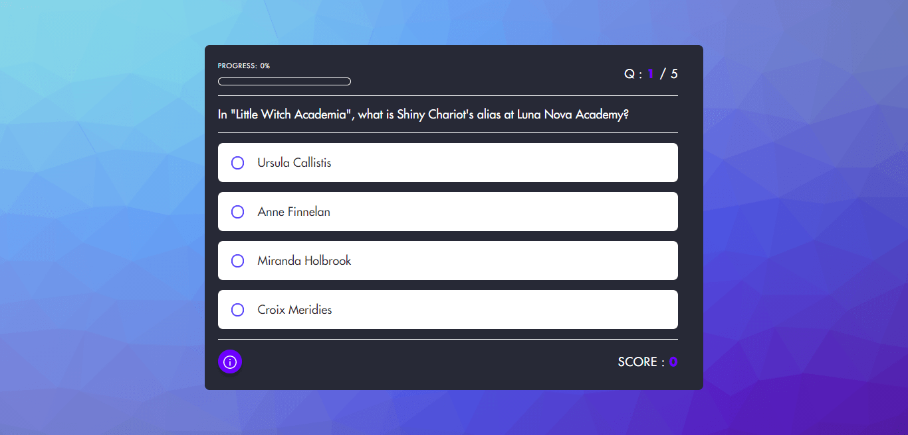
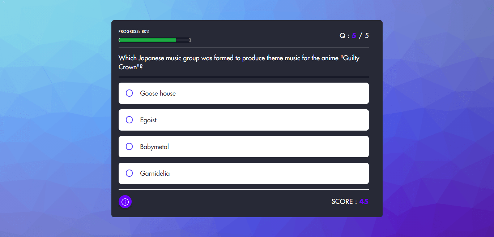
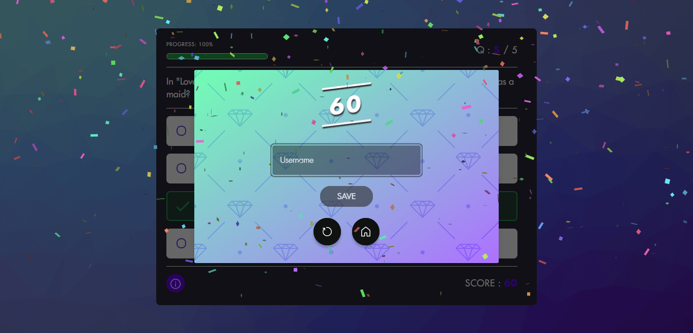
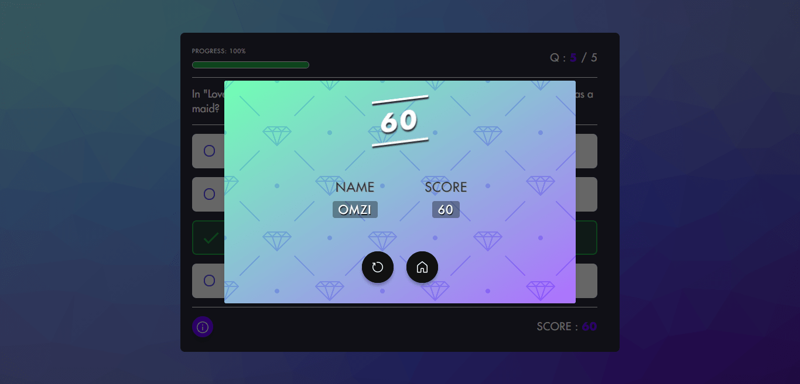

<a href="https://quizmo.netlify.app/" target="_blank">

  

</a>
<h4 align="center">A dandy multiple-choice quiz-taking app🤩✨</h4>
 

 

## 📌 About

This app is basically a remake of James Quick-san's quiz app with extra sauce🤩🔥.

 

## 💻 Stack Overview

The Web 3 (HTML x CSS x JavaScript)

 

## 📷 Screenshots
#1

#2

#3

#4

#5

 

## 🔜 Roadmap
- [X] Home page
- [x] Quiz page
- [X] Quiz summary modal
- [X] Top scores modal
- [x] Deploy to Netlify
- [ ] Add share functionality
- [ ] Add settings functionality
- [ ] Accept user's choice for type & difficulty of quiz questions

**Under consideration** (<em>Probably not</em>🤦‍♂️)
- [ ] Connect to Back-End to permanently save scores

 

<!-- ## 👥 Contributor(s) 

  -->

## 🔐 License
<a href="LICENSE">Apache License</a>, Version 2.0